# 👋 Hi, I'm Rishikant Kumar

### 💻 Software Engineer | ☁️ DevOps Engineer

Computer Science student passionate about building scalable applications, solving problems, and automating software delivery.

* 💻 Full-Stack Development with **Java, React & Node.js**
* ☁️ Cloud & DevOps with **AWS, Docker, Kubernetes & CI/CD**
* 🧠 Practicing **DSA, Core CS & System Design**
* 🚀 Building real-world projects and learning new technologies
* 🔎 Open to **Software Engineer & DevOps internship opportunities**

---

## 🛠️ Tech Stack

### 💻 Languages

`Java` `JavaScript` `C++` `SQL`

### 🎨 Frontend

`React.js` `HTML5` `CSS3` `Tailwind CSS`

### ⚙️ Backend

`Node.js` `Express.js` `REST APIs` `Socket.io`

### 🗄️ Database

`MongoDB` `MySQL`

### ☁️ Cloud & DevOps

`AWS` `Docker` `Kubernetes` `Jenkins` `Linux` `Git` `GitHub`

---

## 🚀 Featured Projects

### 🔹 MERN E-Commerce Platform

**Full-Stack E-Commerce Application**

A complete e-commerce platform with user authentication, product management, shopping cart, orders and admin functionality.

**Tech:** React • Node.js • Express • MongoDB

---

### 🔹 AWS 3-Tier Architecture

**Scalable Cloud Infrastructure**

Designed and deployed a production-style 3-tier architecture using AWS VPC, EC2, RDS, Load Balancer, Auto Scaling, private subnets and NAT Gateway.

**Tech:** AWS • VPC • EC2 • RDS • Load Balancer • Auto Scaling

---

### 🔹 Django Notes App

**Cloud Deployment Project**

Deployed a Django application on AWS EC2 using Docker and Nginx.

**Tech:** Django • Docker • Nginx • AWS EC2 • Linux

---

### 🔹 Uber Clone

**Ride Booking Application**

A ride-booking application inspired by Uber, featuring user authentication, ride management and a responsive user interface.

**Tech:** React • Node.js • Express • MongoDB

---

### 🔹 Phishing Detection Tool

**Suspicious URL Detection Application**

A web application designed to identify potentially suspicious and phishing URLs, helping users recognize unsafe links.

**Tech:** React • JavaScript • CSS

---

## 📊 GitHub Activity

## 📊 GitHub Activity

  

  

  

---

## 🧠 LeetCode Journey

  

  

  <i>🚀 Solving problems consistently and strengthening my DSA skills for Software Engineering interviews.</i>

---

## 🤝 Connect With Me

  
  
  

---

  <b>💡 Build • Learn • Deploy • Repeat 🚀</b>

